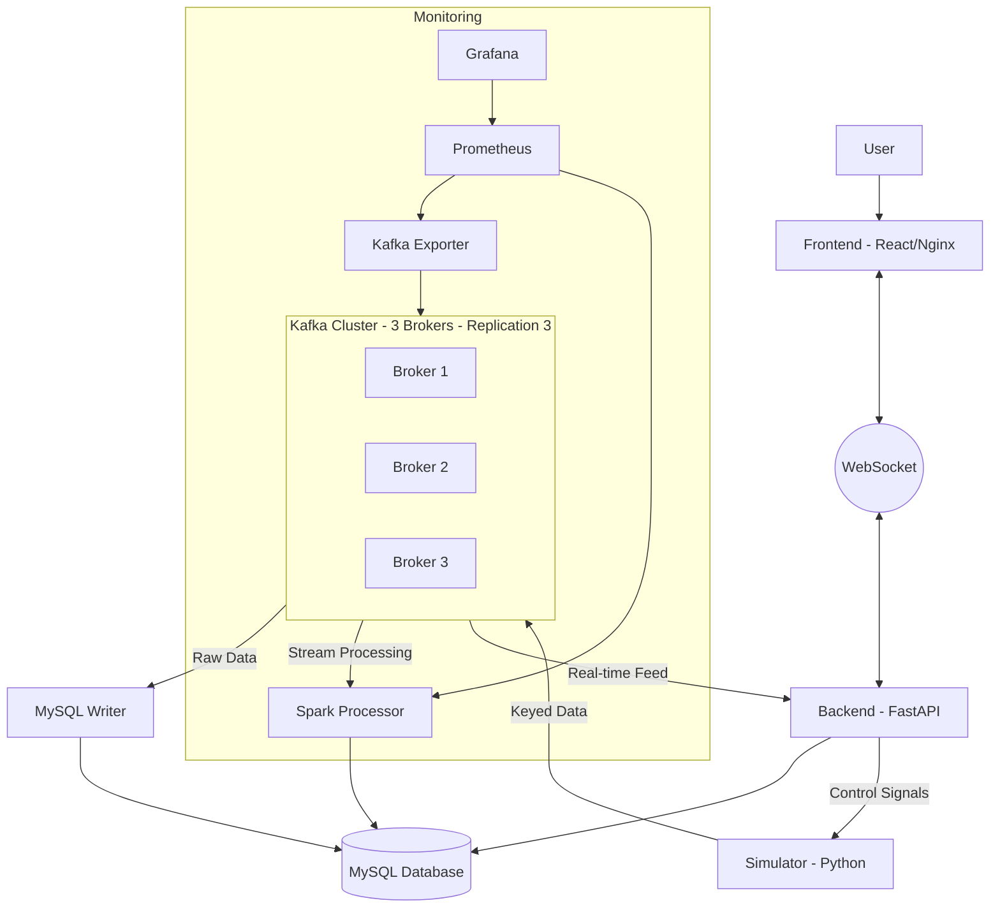

# Real-time Sensor Data Pipeline (Enterprise Edition)

A highly available end-to-end data pipeline with multi-node Kafka, real-time WebSockets, and full monitoring.

## 🚀 New Features

- **High Availability (HA):** 3-node Kafka cluster in KRaft mode with replication factor 3. The pipeline stays alive even if a broker fails.
- **Real-time WebSockets:** Low-latency live data streaming directly from Kafka to the UI via FastAPI WebSockets.
- **Observability Stack:** Integrated **Prometheus** and **Grafana** for monitoring Kafka throughput, consumer lag, and Spark performance.
- **Improved UI:** Polling has been replaced with persistent WebSockets for instantaneous updates.

## 🏗 Architecture & Data Flow



## 🛠 Monitoring Endpoints

- **Grafana Dashboard:** [http://localhost:3001](http://localhost:3001) (Default user/pass: `admin/admin`)
- **Prometheus UI:** [http://localhost:9090](http://localhost:9090)
- **Kafka Exporter:** [http://localhost:9308/metrics](http://localhost:9308/metrics)

## 🛠 Sensor Thresholds & Alerting Rules

The system monitors four types of sensors. When a value exceeds the following thresholds, the **Spark Processor** generates an alert, and the **UI** highlights the data point with a solid red circle.

| Sensor Type | Threshold | Alert Message | Dashboard Color |
| :--- | :--- | :--- | :--- |
| **Temperature** | > 80.0 °C | High Temperature Warning | Orange |
| **Pressure** | > 150.0 PSI | High Pressure Warning | Green |
| **Vibration** | > 10.0 Hz | Unusual Vibration Alert | Purple |
| **Acoustic** | > 90.0 dB | High Noise Level | Blue |

## 🏁 Quick Start

1.  Ensure **Docker** is running and you have enough memory (at least 4GB recommended for the full cluster).
2.  Launch the pipeline:
    ```bash
    chmod +x quickstart.sh
    ./quickstart.sh
    ```
3.  **Dashboard:** [http://localhost:3000](http://localhost:3000)
4.  **API Docs:** [http://localhost:8000/docs](http://localhost:8000/docs)

## 🛑 Shutdown & Cleanup

To stop the pipeline and remove all resources (containers, networks, and volumes):
```bash
chmod +x cleanup.sh
./cleanup.sh
```

This script will also prune unused Docker images to ensure your disk space is reclaimed.

## 📁 Project Structure

- `/simulator`: Kafka Producer with control logic.
- `/consumers/mysql_writer`: Python consumer for persistence.
- `/consumers/spark_processor`: PySpark streaming rules engine.
- `/backend`: FastAPI service with **WebSocket Manager**.
- `/frontend`: React dashboard with **WebSocket Client**.
- `/monitoring`: Prometheus configuration.
- `docker-compose.yml`: Orchestration for 12+ containers.

## 🧠 Design Decisions & Architectural Rationale

### 1. Kafka KRaft Mode over Zookeeper
The cluster uses **Kafka 3.7.0 in KRaft mode**. KRaft eliminates the need for Zookeeper by managing metadata internally within Kafka itself.
- **Why:** This reduces architectural complexity (fewer containers), improves metadata propagation speed, and aligns with the modern standard for production Kafka deployments.

### 2. The 3-Node Cluster & Replication Factor 3
We deployed 3 brokers with a **Replication Factor of 3** and `min.insync.replicas=2`.
- **Why:** This ensures **High Availability (HA)**. The cluster can tolerate the failure of a single broker without any data loss or downtime. Using an odd number of nodes (3) is essential for KRaft controllers to maintain a majority quorum for leader election.

### 3. Keyed Partitioning for Ordering & Parallelism
Messages are produced with the `sensor_type` as the **message key**.
- **Sequential Order:** Kafka guarantees that all messages with the same key are always routed to the same partition. This ensures that sensor data is consumed in the exact order it was generated (Requirement 2a).
- **Parallel Processing:** With 4 partitions, multiple consumers can process different sensors simultaneously, fulfilling the need for high-throughput parallel processing (Requirement 2b).

### 4. Real-time WebSockets vs. Polling
The dashboard was upgraded from 5s REST polling to **FastAPI WebSockets**.
- **Why:** Telemetry data is inherently a "push" model. WebSockets provide instantaneous updates with significantly lower network overhead than constant HTTP requests, creating a professional "live" dashboard experience.

### 5. Spark Structured Streaming for Rules
Alerting is handled by **Apache Spark** rather than the simple MySQL writer.
- **Why:** Spark is designed for complex, stateful stream processing. While the current rules are simple thresholds, this architecture allows for future "advanced" learning features like calculating 5-minute rolling averages or detecting patterns across multiple sensors.

### 6. Multi-stage Nginx Frontend Build
The React UI is built using a **multi-stage Dockerfile** and served via **Nginx**.
- **Why:** In production, you should never use `npm start` (development server). Nginx is a high-performance, secure, and lightweight web server that provides better stability and faster load times for static assets.

### 7. Centralized Observability Stack
Integrated **Prometheus** and **Grafana** using the **Kafka Exporter**.
- **Why:** In a distributed system, "knowing" what is happening is as important as the code itself. This stack allows you to monitor consumer lag (is the DB keeping up?), broker throughput, and system health in a single pane of glass.

