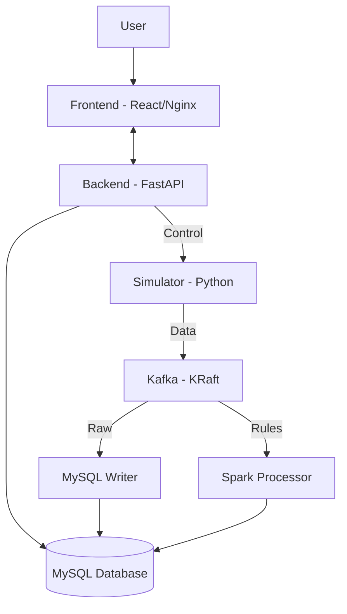

# Real-time Sensor Data Pipeline (KRaft Edition)

A complete end-to-end data pipeline built with Python, Apache Kafka (KRaft), Spark, MySQL, FastAPI, and React.

## 🚀 Key Features

- **Zookeeper-less Architecture:** Uses Apache Kafka 3.7.0 in KRaft mode for high-performance metadata management.
- **Dynamic Control:** Pause/Resume the simulation and adjust data frequency (5s - 30s) directly from the UI.
- **Real-time Monitoring:** Multi-colored line graphs for Temperature, Pressure, Vibration, and Acoustic sensors.
- **Visual Alerting:** Solid red markers automatically appear on graphs when sensor values exceed thresholds.
- **Structured Storage:** Dual-path consumption into MySQL (raw data) and Spark (rule-based alerts).
- **Production-Ready Frontend:** React app served via multi-stage Nginx build.

## 🏗 Architecture



1.  **Simulator (Python):** Generates timeseries data with configurable frequency and control status polling.
2.  **Kafka (Apache 3.7.0):** Keyed partitioning ensures sequential order per sensor type (4 partitions).
3.  **Consumers:**
    *   **MySQL Writer:** Stores raw timeseries data as-is.
    *   **Spark Processor:** PySpark Structured Streaming engine for real-time rule evaluation.
4.  **Backend (FastAPI):** Unified API for data retrieval and simulator control.
5.  **UI (React/Nginx):** Dashboard with real-time charts (Recharts) and alert feed.

## 🛠 Spark & Alerting Rules

| Sensor | Threshold | Notification | Color |
| :--- | :--- | :--- | :--- |
| **Temperature** | > 80°C | High Temperature Warning | Orange |
| **Pressure** | > 150 PSI | High Pressure Warning | Green |
| **Vibration** | > 10 Hz | Unusual Vibration Alert | Purple |
| **Acoustic** | > 90 dB | High Noise Level | Blue |

## 🏁 Quick Start

1.  Ensure **Docker** is running.
2.  Launch the pipeline:
    ```bash
    chmod +x quickstart.sh
    ./quickstart.sh
    ```
3.  **Explore the Dashboard:** [http://localhost:3000](http://localhost:3000)
4.  **Backend API & Docs:** [http://localhost:8000/docs](http://localhost:8000/docs)

## 📁 Project Structure

- `/simulator`: Kafka Producer with control logic.
- `/consumers/mysql_writer`: Python consumer for persistence.
- `/consumers/spark_processor`: PySpark streaming rules engine.
- `/backend`: FastAPI service with simulator state management.
- `/frontend`: Multi-stage React/Nginx frontend.
- `/database`: SQL initialization scripts.
- `/tests`: Python unit tests for core logic.
- `docker-compose.yml`: Full stack orchestration using `sensor-network`.
