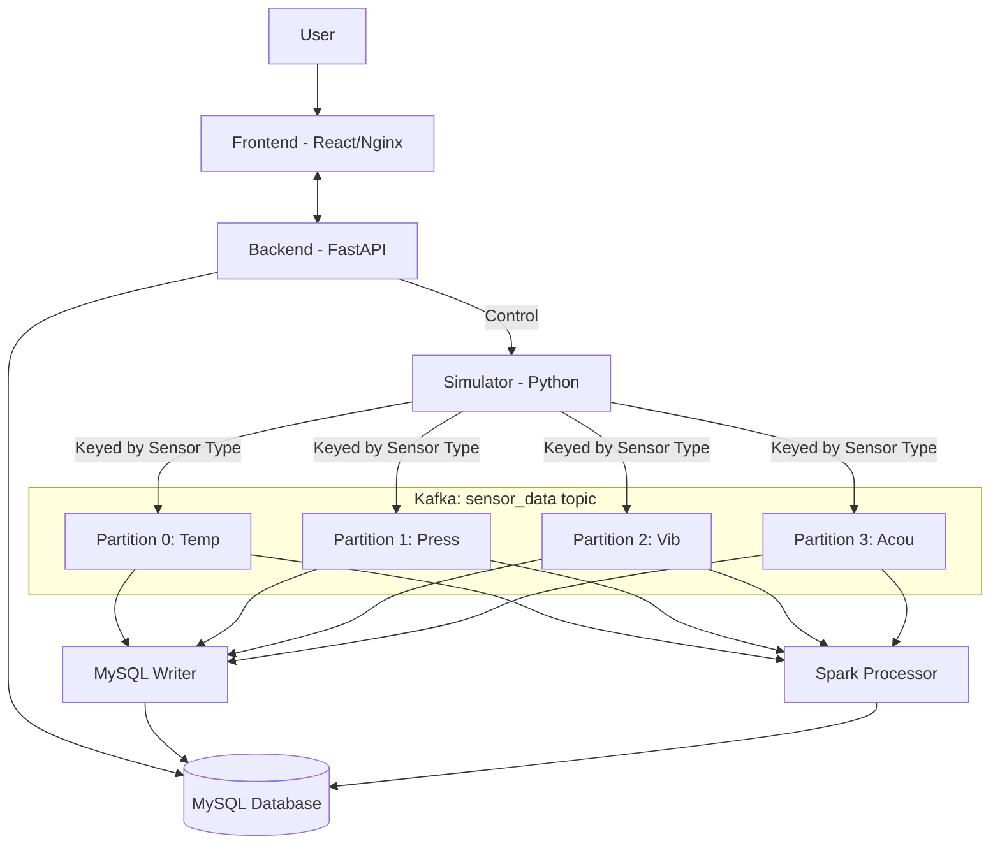

# Real-time Sensor Data Pipeline (KRaft Edition)

A complete end-to-end data pipeline built with Python, Apache Kafka (KRaft), Spark, MySQL, FastAPI, and React.

## 🚀 Key Features

- **Zookeeper-less Architecture:** Uses Apache Kafka 3.7.0 in KRaft mode for high-performance metadata management.
- **Dynamic Control:** Pause/Resume the simulation and adjust data frequency (5s - 30s) directly from the UI.
- **Real-time Monitoring:** Multi-colored line graphs for Temperature, Pressure, Vibration, and Acoustic sensors.
- **Visual Alerting:** Solid red markers automatically appear on graphs when sensor values exceed thresholds.
- **Structured Storage:** Dual-path consumption into MySQL (raw data) and Spark (rule-based alerts).
- **Production-Ready Frontend:** React app served via multi-stage Nginx build.

## 🏗 Architecture & Data Flow



### Kafka Configuration Details
- **Brokers:** 1 Broker running in **KRaft mode** (no Zookeeper required).
- **Topics:** 1 Main topic named `sensor_data`.
- **Partitions:** 4 Partitions (one for each sensor type).
- **Processing Logic:**
    - **Sequential Order:** The Simulator uses the `sensor_type` as the message **key**. Kafka guarantees that all messages with the same key are sent to the same partition, ensuring that a consumer reads a specific sensor's data in the exact order it was generated.
    - **Parallelism:** By having 4 partitions, the pipeline can handle high-throughput loads. Multiple consumer instances (within a consumer group) can attach to different partitions to process data from different sensors simultaneously without blocking each other.

## 🧠 Design Decisions: Why a Single Topic with Keyed Partitions?

Rather than creating a separate topic for each sensor, this architecture uses a single `sensor_data` topic with 4 partitions, keyed by `sensor_type`. This approach was chosen for several technical reasons:

1.  **Guaranteed Sequential Order (Requirement 2a):** By using the `sensor_type` as the message **key**, Kafka ensures that all messages for a specific sensor (e.g., "temperature") always land in the same partition. Kafka guarantees that a consumer will read these messages in the exact order they were produced.
2.  **Efficient Parallelism (Requirement 2b):** Multiple partitions allow for high concurrency. A single consumer group can have multiple consumers working in parallel, with each assigned to a different partition (and thus a different sensor). This fulfills the requirement to process sensor data independently and simultaneously.
3.  **Simplified Stream Processing:** A single Spark Structured Streaming job can subscribe to one topic and process the entire telemetry stream. This is significantly more resource-efficient than managing 4 separate Spark jobs or complex multi-topic unions.
4.  **Unified Schema Management:** Since all sensors share the same data structure (`sensor_type`, `value`, `timestamp`), a single topic maintains a clean, centralized schema, making downstream writes to MySQL more straightforward.
5.  **Scalability:** This pattern scales more gracefully. If new sensor types are added, they can simply use new keys within the existing partitioned topic, reducing the overhead of managing hundreds of individual topics.

## 🛠 Spark & Alerting Rules

| Sensor | Threshold | Notification | Color |
| :--- | :--- | :--- | :--- |
| **Temperature** | > 80°C | High Temperature Warning | Orange |
| **Pressure** | > 150 PSI | High Pressure Warning | Green |
| **Vibration** | > 10 Hz | Unusual Vibration Alert | Purple |
| **Acoustic** | > 90 dB | High Noise Level | Blue |

## 🏁 Quick Start

1.  Ensure **Docker** is running.
2.  Launch the pipeline:
    ```bash
    chmod +x quickstart.sh
    ./quickstart.sh
    ```
3.  **Explore the Dashboard:** [http://localhost:3000](http://localhost:3000)
4.  **Backend API & Docs:** [http://localhost:8000/docs](http://localhost:8000/docs)

## 📁 Project Structure

- `/simulator`: Kafka Producer with control logic.
- `/consumers/mysql_writer`: Python consumer for persistence.
- `/consumers/spark_processor`: PySpark streaming rules engine.
- `/backend`: FastAPI service with simulator state management.
- `/frontend`: Multi-stage React/Nginx frontend.
- `/database`: SQL initialization scripts.
- `/tests`: Python unit tests for core logic.
- `docker-compose.yml`: Full stack orchestration using `sensor-network`.
